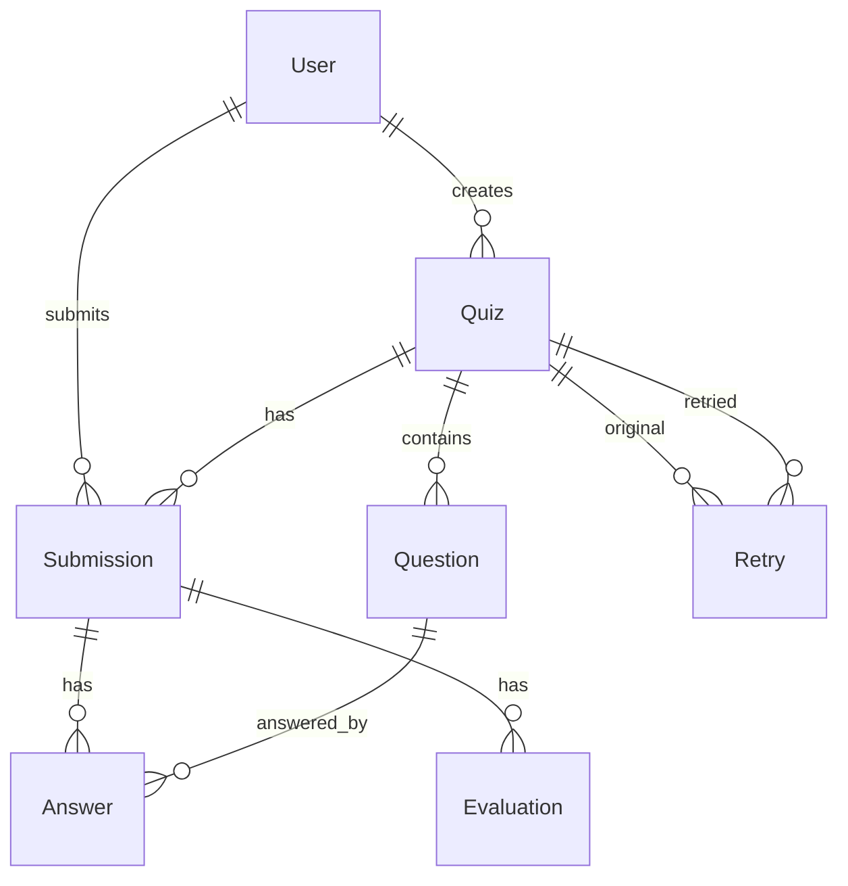

## AI Quiz Microservice — Full Project Context

This document provides everything an LLM (or a new engineer) needs to implement new features safely and consistently in this FastAPI + SQLAlchemy microservice. It captures architecture, data models, services, endpoints, validation, security, testing, deploy, and the exact extension workflow aligned with repo standards.

## Stack and Quality Bar

- Python 3.11, FastAPI, SQLAlchemy 2.x (async), Alembic, PostgreSQL (psycopg3)
- Pydantic v2 schemas; explicit response models; strict validators
- Auth: JWT (HS256) via `PyJWT`; bcrypt for password hashing
- Logging: `structlog` JSON in prod; request_id middleware
- Caching: Redis (optional); graceful fallback if unavailable
- Email: optional SMTP notifications for quiz results
- Tooling: ruff, black, mypy; pytest with coverage ≥ 80% (enforced in `pyproject.toml`)
- Dockerfile, docker-compose for local/dev; health endpoints
- Secrets from environment only; do not hardcode

## Repository Layout

```text
/ (repo root)
  app/
    main.py
    api/
      health.py
      auth.py
      quizzes.py
      hints.py
      adaptive.py
      history.py
      leaderboard.py
    core/
      config.py        # Settings/env
      deps.py          # FastAPI dependencies (DB, Auth)
      errors.py        # AppError hierarchy
      logging.py       # structlog setup
      security.py      # JWT + bcrypt utils
    db/
      session.py       # async engine/session + create_tables()
      migrations/
        env.py
        versions/
          001_initial_migration.py
          002_add_leaderboard.py
    models/
      base.py, user.py, quiz.py, question.py, submission.py,
      answer.py, evaluation.py, retry.py, leaderboard.py
    schemas/
      common.py, auth.py, quiz.py, question.py, submission.py,
      history.py, leaderboard.py
    services/
      ai/
        provider.py      # AIProvider iface + factory (OpenAI→Gemini→Mock)
        openai_provider.py
        gemini_provider.py
        mock.py
      adaptive.py
      grading.py
      cache.py
      leaderboard.py
      datetime.py
      notifications.py
    static/postman_collection.json
  tests/
    test_auth.py, test_health.py, test_quiz_generation.py,
    test_submit_and_evaluate.py, test_history_filters.py,
    test_adaptive_policy.py, test_hint_policy.py
  Dockerfile, docker-compose.yml, start.py, README.md, pyproject.toml
```

## Application Lifecycle and Configuration

- App entry: `app/main.py`
  - `lifespan` initializes logging, creates DB tables (dev convenience), and tries Redis connection; closes Redis on shutdown.
  - CORS: `allowed_origins` drawn from env and expanded to list via `Settings.cors_origins`.
  - Static: mounts `/static` (serves Postman collection).
  - Middleware: request_id injected into logs/response header, request/response logging (skips health).
  - Exceptions: custom handlers for Starlette/FastAPI/Validation/general exceptions; always ensure CORS headers on errors. `AppError` returns a structured `error` envelope.
  - Routers included with tags/prefixes (see Endpoints).

- Settings: `app/core/config.py`
  - Key envs (see docker-compose for defaults/examples):
    - JWT: `JWT_SECRET`, `JWT_ALGORITHM=HS256`, `JWT_EXPIRE_MINUTES=1440`
    - DB: `DATABASE_URL` (psycopg3), `DATABASE_URL_TEST`
    - CORS: `ALLOWED_ORIGINS` (comma-separated). In `dev`, `null` origin also allowed
    - AI: `OPENAI_API_KEY`, `GEMINI_API_KEY`, models
    - Env/Logs: `ENV` in {dev,test,prod}, `LOG_LEVEL`
    - Rate limits: `HINT_RATE_LIMIT_PER_USER_QUESTION` (default 3), `SUBMISSION_RATE_LIMIT_PER_QUIZ` (declared; not currently enforced in code)
    - Redis: `REDIS_URL`, `CACHE_ENABLED` (default true), `CACHE_TTL_SECONDS`
    - Email: `NOTIFICATION_ENABLED`, `SMTP_*`, `NOTIFICATION_FROM_EMAIL`

## Security

- JWT (HS256) in `Authorization: Bearer <token>`; created/verified in `app/core/security.py`.
- Dev/test login accepts any username/password and returns a token; production branch validates against `users` table.
- `get_current_user` dep decodes JWT and returns `CurrentUser` with `id` and `username`.

## Database and ORM

- Async SQLAlchemy engine via `psycopg` driver. URL coercion enforces `postgresql+psycopg://`.
- Async sessions via `async_sessionmaker`; `create_tables()` exists for dev convenience; migrations via Alembic are canonical.

### Data Model Summary

- `User`: username, email, hashed_password; rel: `quizzes`, `submissions`.
- `Quiz`: subject, grade_level, num_questions, difficulty, adaptive flag, topics [JSON], question_types [JSON], standard, description, time_limit, creator_id; rel: `questions`, `submissions`, `retries`.
- `Question`: question_text, type (MCQ|TF|short_answer|essay), difficulty, topic, order, points, options [JSON], correct_answer, explanation, hint_text; rel: `quiz`, `answers`.
- `Submission`: user_id, quiz_id, is_completed, submitted_at, totals (score, percentage), started_at (UTC), time_taken_minutes; rel: `answers`, `evaluation`.
- `Answer`: submission_id, question_id, answer_text/selected_option, correctness, points, ai_feedback, confidence, hints_used, hint_penalty, time_spent_seconds.
- `Evaluation`: denormalized per-submission metrics: totals, per-type/difficulty/topic, strengths/weaknesses/suggestions, performance_level.
- `Retry`: original_quiz_id, retried_quiz_id, retry_number, reason.
- `LeaderboardEntry`: aggregated view-like model for ranking (best/avg scores, totals, activity/accuracy, recency timestamps).



## AI Provider Abstraction

- `services/ai/provider.py` defines `AIProvider` with methods:
  - `generate_questions()`, `grade_short_answer()`, `hint()`, `suggest_improvements()`
- Provider selection (factory): prefers OpenAI when a plausible key is present, else Gemini when key present, else Mock (and always Mock in test env). Priority: OpenAI → Gemini → Mock.
- OpenAI/Gemini providers use `httpx` async calls and parse JSON; prompts enforce “no answer leakage in hints”.
- Mock provider is deterministic and used for tests and fallback.

## Core Domain Services

- Adaptive: `services/adaptive.py`
  - Rolling window (size 3) of last answers → performance ratio
  - Step difficulty up (≥80%), down (≤40%), else hold; picks next unanswered question closest to target difficulty
  - Computes progress: answered, remaining, correct/incorrect, percentage_complete

- Grading: `services/grading.py`
  - MCQ/TF rule-based matching (whitespace/boolean tolerant)
  - Subjective uses AI with early exact-match short-circuit; robust fallback grants partial credit if AI fails
  - Aggregates per-type/difficulty/topic metrics; derives performance_level; produces exactly 2 suggestions
  - Hint penalty: 10% of max points per hint used

- Caching: `services/cache.py`
  - Redis optional; JSON then pickle serialization; keys: `quiz:{id}`, `quiz_questions:{id}`, `leaderboard:{subject}:{grade}`, `user_stats:{id}`
  - TTL default 3600s; disabled gracefully when Redis unavailable or `CACHE_ENABLED=false`

- Leaderboard: `services/leaderboard.py`
  - Aggregates performance across submissions/evaluations by subject/grade
  - Ranking strategies: `best_percentage`, `average_score`, `activity_score`, `total_quizzes`
  - Cached responses; invalidated on updates

- Notifications: `services/notifications.py`
  - Optional SMTP email on submission with HTML/text templates; gated by `NOTIFICATION_ENABLED` and SMTP creds

- Date/Time: `services/datetime.py`
  - Parse ISO or DD/MM/YYYY into UTC; helpers for UTC now and ISO strings

## API Endpoints (paths, auth, schemas)

Base URL: `http://localhost:8000`

- Health
  - GET `/healthz` → `{status, service}`
  - GET `/readyz` → `{status, database}` (touches DB)

- Auth (`/auth`)
  - POST `/login` (LoginRequest → LoginResponse)
  - POST `/register` (dev helper) (UserCreate → UserResponse)

- Quizzes (`/quizzes`) [Bearer required]
  - POST `` (QuizCreate → QuizResponse): generates questions via AI and persists quiz+questions
  - GET `/{quiz_id}` (→ QuizResponse)
  - GET `/{quiz_id}/questions` (→ QuestionResponse[]): no answers exposed; cached
  - POST `/{quiz_id}/submit` (QuizSubmission → SubmissionEvaluation): grades, stores answers+evaluation, updates leaderboard, may send notification
  - POST `/{quiz_id}/retry` (QuizRetryRequest → QuizRetryResponse): copies quiz and records `Retry`

- Hints (`/quizzes/{quiz_id}/questions/{question_id}`) [Bearer]
  - POST `/hint` (HintRequest → HintResponse): in-memory per-user-per-question rate limit; uses AI provider; updates hint usage
  - DELETE `/hint-usage` → dev-only reset for tests

- Adaptive (`/quizzes/{quiz_id}`) [Bearer]
  - POST `/next` (NextQuestionRequest → NextQuestionResponse): adaptive next question
  - GET `/adaptive-status` → current session status/progress

- History (`/quiz-history`) [Bearer]
  - GET `` (query filters → HistoryResponse): filter by grade, subject, marks range, date range; robust date parsing

- Leaderboard [Bearer]
  - GET `/leaderboard` (→ LeaderboardResponse): subject+grade+limit+ranking_type
  - GET `/leaderboard/my-rank` (→ UserRankResponse)
  - GET `/leaderboard/subjects` (→ string[])
  - GET `/leaderboard/grades` (→ string[]; optional subject)

### Error Handling Contract

- AppError hierarchy (`errors.py`): `ValidationError` (422), `AuthenticationError` (401), `AuthorizationError` (403), `NotFound` (404), `Conflict` (409), `RateLimitError` (429), `AIServiceError` (503)
- When raised, API returns:
```json
{
  "error": { "code": "VALIDATION_ERROR", "message": "...", "field": "..." }
}
```
- For framework exceptions (HTTPException, Pydantic validation, generic), handlers ensure CORS headers and return `{"detail": ...}` with appropriate status.

## Validation Rules

- Pydantic v2 schemas in `app/schemas/*` with field validators:
  - Difficulty: one of easy|medium|hard|adaptive (quiz create); question_types must be in MCQ|TF|short_answer|essay
  - Submission requires either `answer_text` or `selected_option` per answer
  - History filters enforce ranges and date parsing (ISO or DD/MM/YYYY)

## Observability

- Structured logs with `structlog`; JSON in prod, console in dev.
- Request/response logging middleware with `X-Request-ID` header.
- Health checks: `/healthz`, `/readyz`.

## Running, Migrations, Deploy

- Local (compose): DB + Redis + API with reload
  - `docker compose up -d --build`
  - API on `:8000`, Postgres on `:5432`, Redis on `:6379`
  - API service runs `alembic upgrade head` before uvicorn
- Standalone dev: `start.py` waits for DB, runs migrations, starts uvicorn
- Dockerfile: Python 3.11-slim, non-root `appuser`, healthcheck hits `/healthz`

## Testing

- Tests in `tests/` cover: auth, health, quiz generation, submission/evaluation, history filters, adaptive policy, hint policy/rate limiting
- `pyproject.toml` enforces: coverage ≥ 80%, asyncio auto mode; ruff/black/mypy configured

## Coding/Design Constraints and Practices

- Pydantic v2 response models; explicit schema classes; no answer leakage in question/hint responses
- Use UTC everywhere; `services/datetime.py` helpers
- Strict input validation; return `VALIDATION_ERROR` with field paths where applicable
- No synchronous network calls inside DB transactions (AI calls made before/after commits; DB flush where needed)
- Log with request_id; redact sensitive fields when logging
- CORS allowlist controlled via `ALLOWED_ORIGINS`

## How to Add a New Feature (step-by-step)

1) Define API contract
   - Add/extend schema(s) in `app/schemas/` with Pydantic v2; include validators
   - Document the endpoint(s): method, path, auth, request/response examples

2) Data model changes (if needed)
   - Update/introduce SQLAlchemy models in `app/models/`
   - Create Alembic migration: `alembic revision -m "feat: <summary>"` and implement `upgrade()/downgrade()`
   - Run `alembic upgrade head`; add integration test covering migration up/down if applicable

3) Business logic
   - Implement or extend services in `app/services/` (AI/caching/notifications/adaptive/etc.)
   - Keep AI calls outside DB transactions; handle timeouts/retries; provide fallbacks

4) API router
   - Create/modify router in `app/api/` and include it in `app/main.py` with proper prefix/tags
   - Use dependencies: `DBSession` and `AuthUser` where required; type-annotate responses
   - Enforce rate limits or policy (e.g., hints) if applicable

5) Error handling
   - Use `AppError` subclasses for domain errors; let global handlers format responses
   - Validate inputs with helpful error messages; keep field-level details

6) Caching (optional)
   - Use `CacheService` via `get_cache()`; namespace keys and set sensible TTLs
   - Invalidate caches on write operations

7) Observability
   - Add `structlog` info/debug lines with safe context; never log secrets or raw `Authorization`

8) Docs & DX
   - Update OpenAPI examples via Pydantic schema examples (if relevant)
   - Update `README.md` and Postman collection (`app/static/postman_collection.json`)

9) Tests (aim ≥80% coverage)
   - Unit tests for validators/services
   - Integration tests for endpoints, migrations, and filter logic
   - Contract checks for OpenAPI if applicable

10) Ship
   - Run: lint, type, tests; ensure green
   - Conventional commit and small PR (< 400 LOC recommended)

## Known Behaviors and Notes

- Hint rate limit is in-memory per-process; for distributed deployments, switch to Redis-backed counters
- `SUBMISSION_RATE_LIMIT_PER_QUIZ` exists in settings but is not enforced yet
- In `dev/test`, `/auth/login` accepts any credentials and issues a JWT for convenience
- CORS error responses explicitly add headers to avoid browser blocks (including `null` origin in `dev` for `file://` use)

## Quick Reference — Key Schemas

- QuizCreate: `subject, grade_level, num_questions (1–50), difficulty (easy|medium|hard|adaptive), topics[], question_types[], standard?, adaptive`
- QuizResponse: quiz metadata; never exposes answers
- QuestionResponse: question view for clients; no answers/explanations
- QuizSubmission: `answers[{question_id, answer_text? | selected_option?, time_spent_seconds?}], time_taken_minutes?`
- SubmissionEvaluation: totals, per-type/difficulty/topic metrics, exactly 2 `suggestions`, `strengths`, `weaknesses`, per-answer breakdown
- HintResponse: `hint, hints_used, remaining_hints`
- HistoryResponse: paginated `SubmissionSummary[]` + filters applied
- LeaderboardResponse/UserRankResponse: ranked entries and user position

---

This CONTEXT.md reflects the current codebase and tests. Use it as the single source of truth for feature planning and LLM prompts, ensuring new work adheres to validation, security, observability, and testing standards already in place.