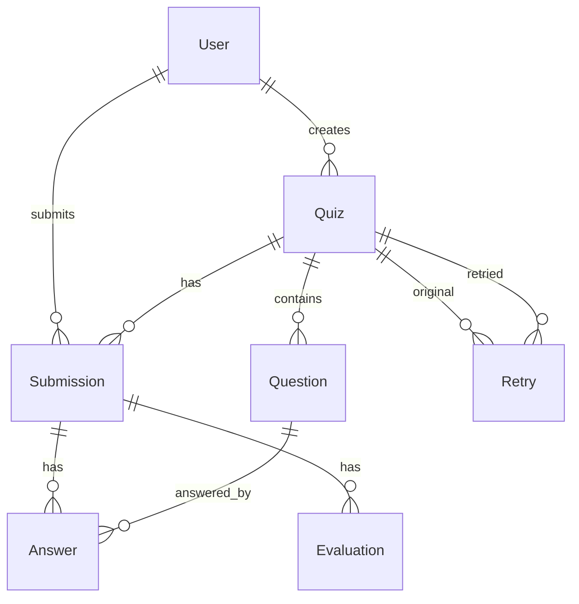

# AI Quiz Microservice

AI-powered quiz generation, evaluation, and adaptive learning microservice built with FastAPI, SQLAlchemy, Alembic, and PostgreSQL. Production-ready with Docker, health checks, structured logging, and CI.

## Features

- 🤖 AI‑powered question generation (OpenAI or Gemini; Mock for tests)
- 🧠 AI‑assisted grading for short/subjective answers with detailed feedback
- 🎯 Adaptive learning (next question based on rolling performance)
- 📊 Analytics and leaderboard with caching
- 🔒 JWT authentication and rate limiting (hints, submissions)
- 📜 OpenAPI auto‑docs, Postman collection, and thorough tests

## Setup Instructions

### Prerequisites

- Python 3.11+
- PostgreSQL 15+
- Docker + Docker Compose (optional but recommended)

### Local development

1) Clone and create a virtualenv
```bash
git clone <repository-url>
cd ai-quiz-microservice
python -m venv .venv
# Windows: .venv\Scripts\activate
source .venv/bin/activate
```

2) Install dependencies and pre-commit hooks
```bash
make install
```

3) Configure environment
```bash
cp .env.example .env
# Edit .env and set DATABASE_URL, JWT_SECRET, and allowed origins
```

4) Start Postgres (via Docker) and run migrations
```bash
# Bring up DB + Redis + API (quick path)
make up

# Or, if you run the API locally, start only DB
docker compose up -d db redis

# Apply migrations (API container also runs this on boot)
make migrate
```

5) Start the dev server
```bash
make dev
# Visit http://localhost:8000/docs
```

6) Smoke test
```bash
curl http://localhost:8000/healthz
curl http://localhost:8000/readyz
```

### Docker Compose

Fastest end-to-end setup (DB, Redis, API with autoreload):
```bash
cp .env.example .env
docker compose up -d --build
docker compose logs -f web
```
Expose: API at http://localhost:8000, Postgres at localhost:5432.

Useful commands:
```bash
docker compose exec web alembic upgrade head
docker compose exec web python create_test_user.py
docker compose down        # keep volumes
docker compose down -v     # wipe data
```

### Testing, linting, typing
```bash
make test
make lint
make format
make type
```

## Deploying on Render (current hosting)

This repo includes `render.yaml` for blueprint deployments and a full guide in `DEPLOYMENT.md`.

High‑level steps:
1) Fork repo and connect it in the Render dashboard (New → Blueprint)
2) Render provisions services from `render.yaml`: web app, Redis, Postgres, static frontend
3) Configure environment variables (web service):
   - `ENV=production`
   - `JWT_SECRET` (auto‑generated or set manually)
   - `DATABASE_URL` (from managed Postgres)
   - `REDIS_URL` (from managed Redis)
   - Optional AI keys: `OPENAI_API_KEY` or `GEMINI_API_KEY`
4) Render will build and start the service using `start.py` and health check at `/healthz`

Docs after deploy: `https://<your-service>.onrender.com/docs`

## AI Integration Details

- Provider abstraction in `app/services/ai/provider.py` with priority: OpenAI → Gemini → Mock. In tests mode, always Mock.
- Configure via env:
  - `OPENAI_API_KEY` for OpenAI Chat Completions (`gpt-3.5-turbo`)
  - `GEMINI_API_KEY` for Google Generative Language API (`gemini-1.5-flash`, fallback `gemini-2.0-flash-lite`)
- Where AI is used:
  - POST `/quizzes`: `generate_questions()` to produce quiz items
  - POST `/quizzes/{quiz_id}/submit`: grading short/essay answers via `grade_short_answer()`
  - POST `/quizzes/{quiz_id}/questions/{question_id}/hint`: `hint()` for safe, non‑leaking hints
  - Grading adds `suggestions`, `strengths`, `weaknesses` via `suggest_improvements()`
- Rate limits: `HINT_RATE_LIMIT_PER_USER_QUESTION` (default 3) and `SUBMISSION_RATE_LIMIT_PER_QUIZ` (default 10)

## Authentication

- JWT Bearer tokens; set `JWT_SECRET`.
- Development mode allows any username/password for `/auth/login` to simplify testing; production validates users from DB.
- Send header: `Authorization: Bearer <token>`

## Complete API Reference

Base URL: `http://localhost:8000`

### Health

- GET `/healthz`
  - Auth: none
  - 200: `{ "status": "healthy", "service": "ai-quiz-microservice" }`

- GET `/readyz`
  - Auth: none
  - 200: `{ "status": "ready", "database": "connected" }` or 200 with error string if DB unreachable

### Auth

- POST `/auth/login`
  - Auth: none
  - Request:
    ```json
    { "username": "string", "password": "string" }
    ```
  - Response:
    ```json
    { "access_token": "string", "token_type": "bearer", "expires_in": 86400 }
    ```

- POST `/auth/register`
  - Auth: none (dev helper)
  - Request:
    ```json
    { "username": "string", "email": "user@example.com", "password": "string" }
    ```
  - Response:
    ```json
    { "id": 1, "username": "string", "email": "user@example.com", "created_at": "..." }
    ```

### Quizzes

- POST `/quizzes`
  - Auth: Bearer
  - Body (QuizCreate):
    ```json
    {
      "subject": "Mathematics",
      "grade_level": "8",
      "num_questions": 5,
      "difficulty": "medium",
      "topics": ["algebra", "geometry"],
      "question_types": ["MCQ", "TF", "short_answer"],
      "standard": "Common Core",
      "adaptive": false
    }
    ```
  - 200 (QuizResponse): fields include `id,title,subject,grade_level,num_questions,difficulty,adaptive,topics,question_types,standard,is_published,creator_id,created_at,updated_at`

- GET `/quizzes/{quiz_id}`
  - Auth: Bearer
  - 200: QuizResponse (no answers exposed)

- GET `/quizzes/{quiz_id}/questions`
  - Auth: Bearer
  - 200: `QuestionResponse[]` (no correct answers)

- POST `/quizzes/{quiz_id}/submit`
  - Auth: Bearer
  - Body (QuizSubmission):
    ```json
    {
      "answers": [
        { "question_id": 1, "selected_option": "Option A", "time_spent_seconds": 30 },
        { "question_id": 2, "answer_text": "..." }
      ],
      "time_taken_minutes": 15
    }
    ```
  - 200 (SubmissionEvaluation): totals, percentages, per-type/difficulty/topic breakdown, AI suggestions, strengths/weaknesses, per-answer feedback

- POST `/quizzes/{quiz_id}/retry`
  - Auth: Bearer
  - Body:
    ```json
    { "reason": "string (optional)" }
    ```
  - 200:
    ```json
    { "new_quiz_id": 2, "retry_number": 1, "message": "Retry 1 created successfully" }
    ```

### Hints

- POST `/quizzes/{quiz_id}/questions/{question_id}/hint`
  - Auth: Bearer
  - Body: `{}`
  - 200 (HintResponse):
    ```json
    { "hint": "text", "hints_used": 1, "remaining_hints": 2 }
    ```
  - 429 (RateLimitError) after configured limit

- DELETE `/quizzes/{quiz_id}/questions/{question_id}/hint-usage`
  - Auth: Bearer, available only in development
  - 200: `{ "message": "Hint usage reset successfully" }`

### Adaptive

- POST `/quizzes/{quiz_id}/next`
  - Auth: Bearer
  - Body: `{}`
  - 200 (NextQuestionResponse): `{ "question": QuestionResponse | null, "is_complete": bool, "progress": {"answered": n, "total": n} }`

- GET `/quizzes/{quiz_id}/adaptive-status`
  - Auth: Bearer
  - 200: status of adaptive session (active or not) and progress

### History

- GET `/quiz-history`
  - Auth: Bearer
  - Query params: `grade, subject, min_marks, max_marks, from_date, to_date, completed_date, limit=20, offset=0`
  - 200 (HistoryResponse): paginated `SubmissionSummary[]` and filters applied

### Leaderboard

- GET `/leaderboard`
  - Auth: Bearer
  - Query: `subject` (required), `grade_level` (required), `limit` (default 10), `ranking_type` (best_percentage|average_score|activity_score|total_quizzes)
  - 200 (LeaderboardResponse): entries with ranks and metrics

- GET `/leaderboard/my-rank`
  - Auth: Bearer
  - Query: `subject`, `grade_level`
  - 200 (UserRankResponse)

- GET `/leaderboard/subjects`
  - Auth: Bearer
  - 200: `string[]`

- GET `/leaderboard/grades`
  - Auth: Bearer
  - Query: optional `subject`
  - 200: `string[]`

## Database Schema

Tables (PostgreSQL): `users`, `quizzes`, `questions`, `submissions`, `answers`, `evaluations`, `retries`, `leaderboard_entries`.

- `users`: auth and ownership
- `quizzes`: quiz metadata and config (topics, difficulty, types)
- `questions`: per-quiz items; JSON options for MCQ/TF; no answer leakage via API
- `submissions`: an attempt; tracks started/submitted timestamps and aggregates
- `answers`: per-question responses with grading and hint usage
- `evaluations`: denormalized scoring and AI feedback
- `retries`: mapping original→retried quizzes
- `leaderboard_entries`: aggregated performance for caching/ranking

ER diagram:


Key indexes optimize common queries (joins, filtering, sorting) and JSONB is used where appropriate for flexible content.

## Configuration

Environment variables (subset):

| Variable | Description | Default |
|---|---|---|
| `JWT_SECRET` | JWT signing secret (HS256) | Required |
| `DATABASE_URL` | PostgreSQL URL (`postgresql+psycopg://...`) | Required |
| `ALLOWED_ORIGINS` | CORS allowlist (comma-separated) | `http://localhost:3000,http://localhost:8000` |
| `ENV` | `dev` | `dev` |
| `LOG_LEVEL` | Logging level | `INFO` |
| `OPENAI_API_KEY` | OpenAI key (optional) | "" |
| `GEMINI_API_KEY` | Gemini key (optional) | "" |
| `REDIS_URL` | Redis connection string | `redis://localhost:6379/0` |
| `CACHE_ENABLED` | Enable cache | `true` |
| `CACHE_TTL_SECONDS` | TTL for cache | `3600` |
| `HINT_RATE_LIMIT_PER_USER_QUESTION` | Hints per user/question | `3` |
| `SUBMISSION_RATE_LIMIT_PER_QUIZ` | Submissions per quiz | `10` |
| `NOTIFICATION_ENABLED` | Email notifications | `false` |
| `SMTP_HOST`/`SMTP_PORT`/`SMTP_USERNAME`/`SMTP_PASSWORD`/`SMTP_USE_TLS` | SMTP config | See `.env.example` |

## Postman & OpenAPI

- Swagger UI: `http://localhost:8000/docs`
- ReDoc: `http://localhost:8000/redoc`
- Postman collection: `postman/quiz-service.postman_collection.json`

## Project scripts and Make targets

```bash
make install       # deps + pre-commit
make dev           # dev server with reload
make migrate       # alembic upgrade head
make new-migration MESSAGE="add table"
make test | lint | format | type
make up | down | logs | clean
```

## License

MIT

---

Built with FastAPI, SQLAlchemy, Alembic, and modern Python practices.


