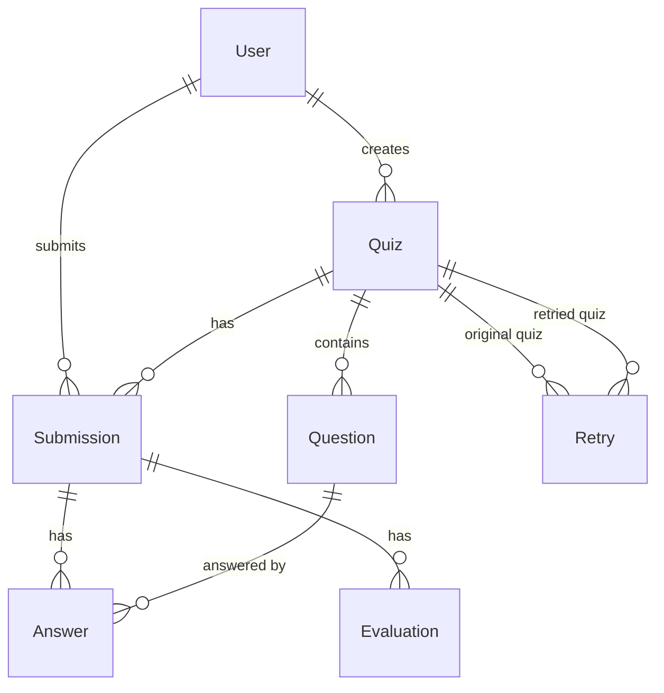

# Database Schema Documentation

This document describes the database schema and models used in the AI Quiz Service.

## Entity Relationship Diagram



## Tables

### Users

Stores user information and authentication details.

```sql
CREATE TABLE users (
    id SERIAL PRIMARY KEY,
    username VARCHAR(50) NOT NULL UNIQUE,
    email VARCHAR(100) NOT NULL UNIQUE,
    hashed_password VARCHAR(255) NOT NULL,
    created_at TIMESTAMP WITH TIME ZONE NOT NULL DEFAULT now(),
    updated_at TIMESTAMP WITH TIME ZONE NOT NULL DEFAULT now()
);

CREATE INDEX idx_user_username_email ON users(username, email);
```

### Quizzes

Stores quiz metadata and configuration.

```sql
CREATE TABLE quizzes (
    id SERIAL PRIMARY KEY,
    title VARCHAR(200) NOT NULL,
    subject VARCHAR(100) NOT NULL,
    grade_level VARCHAR(50) NOT NULL,
    num_questions INTEGER NOT NULL,
    difficulty VARCHAR(50) NOT NULL,
    adaptive BOOLEAN NOT NULL DEFAULT false,
    topics JSONB NOT NULL,
    question_types JSONB NOT NULL,
    standard VARCHAR(100),
    description TEXT,
    time_limit_minutes INTEGER,
    creator_id INTEGER NOT NULL REFERENCES users(id),
    is_published BOOLEAN NOT NULL DEFAULT false,
    completed_at TIMESTAMP WITH TIME ZONE,
    created_at TIMESTAMP WITH TIME ZONE NOT NULL DEFAULT now(),
    updated_at TIMESTAMP WITH TIME ZONE NOT NULL DEFAULT now()
);

CREATE INDEX idx_quiz_subject_grade ON quizzes(subject, grade_level);
CREATE INDEX idx_quiz_creator_created ON quizzes(creator_id, created_at);
CREATE INDEX idx_quiz_difficulty ON quizzes(difficulty);
CREATE INDEX idx_quiz_published ON quizzes(is_published);
```

### Questions

Stores individual quiz questions.

```sql
CREATE TABLE questions (
    id SERIAL PRIMARY KEY,
    quiz_id INTEGER NOT NULL REFERENCES quizzes(id),
    question_text TEXT NOT NULL,
    question_type VARCHAR(50) NOT NULL,
    difficulty VARCHAR(50) NOT NULL,
    topic VARCHAR(100) NOT NULL,
    order INTEGER NOT NULL,
    points INTEGER NOT NULL DEFAULT 1,
    options JSONB,
    correct_answer TEXT,
    explanation TEXT,
    hint_text TEXT,
    created_at TIMESTAMP WITH TIME ZONE NOT NULL DEFAULT now(),
    updated_at TIMESTAMP WITH TIME ZONE NOT NULL DEFAULT now()
);

CREATE INDEX idx_question_quiz_order ON questions(quiz_id, order);
CREATE INDEX idx_question_type ON questions(question_type);
CREATE INDEX idx_question_difficulty ON questions(difficulty);
```

### Submissions

Stores quiz submissions and overall results.

```sql
CREATE TABLE submissions (
    id SERIAL PRIMARY KEY,
    user_id INTEGER NOT NULL REFERENCES users(id),
    quiz_id INTEGER NOT NULL REFERENCES quizzes(id),
    is_completed BOOLEAN NOT NULL DEFAULT false,
    submitted_at TIMESTAMP WITH TIME ZONE,
    total_score FLOAT,
    max_possible_score FLOAT,
    percentage FLOAT,
    started_at TIMESTAMP WITH TIME ZONE NOT NULL,
    time_taken_minutes INTEGER,
    created_at TIMESTAMP WITH TIME ZONE NOT NULL DEFAULT now(),
    updated_at TIMESTAMP WITH TIME ZONE NOT NULL DEFAULT now()
);

CREATE INDEX idx_submission_user_quiz ON submissions(user_id, quiz_id);
CREATE INDEX idx_submission_completed ON submissions(is_completed);
CREATE INDEX idx_submission_submitted_at ON submissions(submitted_at);
CREATE INDEX idx_submission_user_submitted ON submissions(user_id, submitted_at);
```

### Answers

Stores individual question answers and evaluations.

```sql
CREATE TABLE answers (
    id SERIAL PRIMARY KEY,
    submission_id INTEGER NOT NULL REFERENCES submissions(id),
    question_id INTEGER NOT NULL REFERENCES questions(id),
    answer_text TEXT,
    selected_option TEXT,
    is_correct BOOLEAN,
    points_earned FLOAT,
    max_points FLOAT,
    ai_score FLOAT,
    ai_feedback TEXT,
    confidence_score FLOAT,
    hints_used INTEGER NOT NULL DEFAULT 0,
    hint_penalty FLOAT DEFAULT 0.0,
    time_spent_seconds INTEGER,
    created_at TIMESTAMP WITH TIME ZONE NOT NULL DEFAULT now(),
    updated_at TIMESTAMP WITH TIME ZONE NOT NULL DEFAULT now()
);

CREATE INDEX idx_answer_submission_question ON answers(submission_id, question_id);
CREATE INDEX idx_answer_question ON answers(question_id);
CREATE INDEX idx_answer_is_correct ON answers(is_correct);
```

### Evaluations

Stores detailed evaluation results and AI feedback.

```sql
CREATE TABLE evaluations (
    id SERIAL PRIMARY KEY,
    submission_id INTEGER NOT NULL REFERENCES submissions(id),
    total_score FLOAT NOT NULL,
    max_possible_score FLOAT NOT NULL,
    percentage FLOAT NOT NULL,
    correct_answers INTEGER NOT NULL,
    total_questions INTEGER NOT NULL,
    mcq_score FLOAT,
    tf_score FLOAT,
    short_answer_score FLOAT,
    essay_score FLOAT,
    easy_score FLOAT,
    medium_score FLOAT,
    hard_score FLOAT,
    topic_scores JSONB,
    strengths JSONB NOT NULL DEFAULT '[]',
    weaknesses JSONB NOT NULL DEFAULT '[]',
    suggestions JSONB NOT NULL DEFAULT '[]',
    overall_feedback TEXT,
    improvement_areas TEXT,
    performance_level VARCHAR(50),
    created_at TIMESTAMP WITH TIME ZONE NOT NULL DEFAULT now(),
    updated_at TIMESTAMP WITH TIME ZONE NOT NULL DEFAULT now()
);

CREATE INDEX idx_evaluation_submission ON evaluations(submission_id);
CREATE INDEX idx_evaluation_percentage ON evaluations(percentage);
CREATE INDEX idx_evaluation_performance_level ON evaluations(performance_level);
```

### Retries

Tracks quiz retake attempts.

```sql
CREATE TABLE retries (
    id SERIAL PRIMARY KEY,
    original_quiz_id INTEGER NOT NULL REFERENCES quizzes(id),
    retried_quiz_id INTEGER NOT NULL REFERENCES quizzes(id),
    retry_number INTEGER NOT NULL,
    reason VARCHAR(200),
    created_at TIMESTAMP WITH TIME ZONE NOT NULL DEFAULT now(),
    updated_at TIMESTAMP WITH TIME ZONE NOT NULL DEFAULT now()
);

CREATE INDEX idx_retry_original_quiz ON retries(original_quiz_id);
CREATE INDEX idx_retry_retried_quiz ON retries(retried_quiz_id);
CREATE INDEX idx_retry_number ON retries(retry_number);
```

## Data Types

- **JSONB**: Used for flexible data structures (topics, options, scores)
- **TIMESTAMP WITH TIME ZONE**: All timestamps are stored in UTC
- **VARCHAR**: String fields with length limits
- **TEXT**: Unlimited length text fields
- **INTEGER**: Whole numbers
- **FLOAT**: Decimal numbers
- **BOOLEAN**: True/false values

## Relationships

1. **User → Quiz**: One-to-many (creator)
2. **User → Submission**: One-to-many
3. **Quiz → Question**: One-to-many
4. **Quiz → Submission**: One-to-many
5. **Quiz → Retry**: One-to-many (both original and retried)
6. **Submission → Answer**: One-to-many
7. **Submission → Evaluation**: One-to-one
8. **Question → Answer**: One-to-many

## Indexes

Strategic indexes are created for:
- Foreign key relationships
- Frequently filtered fields
- Sorting operations
- Composite queries

## Migrations

Database migrations are managed with Alembic:

```bash
# Create new migration
alembic revision -m "description"

# Run migrations
alembic upgrade head

# Rollback
alembic downgrade -1
```

## Example Queries

### Get User's Quiz History
```sql
SELECT 
    q.title,
    s.percentage,
    s.submitted_at,
    e.performance_level
FROM submissions s
JOIN quizzes q ON s.quiz_id = q.id
LEFT JOIN evaluations e ON s.id = e.submission_id
WHERE s.user_id = :user_id
ORDER BY s.submitted_at DESC;
```

### Get Quiz Performance by Topic
```sql
SELECT 
    q.topic,
    AVG(a.points_earned / a.max_points) as avg_score,
    COUNT(*) as total_questions
FROM answers a
JOIN questions q ON a.question_id = q.id
WHERE a.submission_id = :submission_id
GROUP BY q.topic;
```

### Get Retry Statistics
```sql
SELECT 
    r.retry_number,
    s1.percentage as original_score,
    s2.percentage as retry_score
FROM retries r
JOIN submissions s1 ON r.original_quiz_id = s1.quiz_id
JOIN submissions s2 ON r.retried_quiz_id = s2.quiz_id
WHERE r.original_quiz_id = :quiz_id;
```
